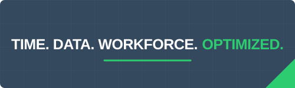

  

  <h2>Enterprise WFM Architect | Boomi Integration Developer | Integration & Data Strategy</h2>

  

    <strong>ID: KG - 832</strong> 
    Status: Online 
    Location: Houston, TX
  

  

  

  

---

### Professional Profile

> I help organizations transform workforce management data into operational intelligence.
>
> I specialize in **UKG Pro WFM**, workforce analytics, governance, integrations, automation, and workforce transformation initiatives that reduce labor risk, improve visibility, strengthen compliance, and improve workforce performance.
>
> My focus extends beyond software implementation. I design workforce management architectures that align business strategy, operational execution, and enterprise data within a trusted operating model.

---

### Strategic Focus

| Focus Area | Delivery |
| :--- | :--- |
| **Consulting Engagements** | UKG architecture, optimization, analytics, governance, and workforce transformation services. |
| **Workforce Intelligence Products** | LaborSight, WorkforceOS, and workforce analytics accelerators. |
| **Professional Insights** | Implementation patterns, operational guidance, and field-tested UKG best practices. |

---

### Consulting Services

| Service | Capability |
| :--- | :--- |
| **UKG Pro WFM Optimization** | Timekeeping, Scheduling, Accruals, Attendance, Leave, and Absence |
| **Workforce Analytics** | Power BI, DataHub, Executive Dashboards, and KPI Development |
| **Integration Architecture** | UKG APIs, Boomi, Payroll Interfaces, and Data Pipelines |
| **Workforce Governance** | Security, Audit Readiness, Compliance, and Operational Controls |
| **Fractional UKG Architecture** | Embedded SME Services, Strategic Roadmaps, and Advisory Leadership |

---

### Workforce Technology Stack

| Category | Technologies |
| :--- | :--- |
| **Platforms** | UKG Pro WFM · UKG Workforce Central · UKG Ready · UKG Pro |
| **Analytics** | UKG DataHub · Power BI · Google BigQuery |
| **Integration** | UKG APIs · Boomi · Retool |
| **Cloud** | Azure · Google Cloud · Oracle Cloud Infrastructure |

---

### Development and Delivery Stack

  

---

### Current Strategic Initiatives

Selected initiatives focused on measurable workforce, data, financial-control, and operational outcomes.

| Financial Control | Operational Efficiency | Data Integrity |
| :--- | :--- | :--- |
| **Premium Pay Drift** | **Approvals Backlog** | **Master Data Quality** |
| Audit tooling designed to prevent labor-cost leakage and pay-rule drift. | Workflow automation designed to clear more than 500 stalled requests. | Data governance designed to improve workforce reporting trust and consistency. |

---

### Selected Case Studies

| Case Study | Outcome |
| :--- | :--- |
| **Healthcare Geofence Modernization** | Designed and deployed workforce location-validation controls that improved audit readiness and location accuracy. |
| **Premium Pay Governance** | Identified labor-cost leakage opportunities and strengthened payroll-control mechanisms. |
| **Executive Workforce Analytics** | Delivered workforce-intelligence dashboards supporting executive staffing and labor decisions. |
| **Approval Workflow Optimization** | Eliminated operational bottlenecks and restored workforce-process efficiency across large request queues. |
| **UKG DataHub Reporting Architecture** | Established scalable reporting foundations that improved visibility, governance, and reporting consistency. |

---

### Product and Research Initiatives

- LaborSight Workforce Analytics Platform
- WorkforceOS Operations Framework
- UKG Reporting Accelerators
- Healthcare Workforce Intelligence Models
- Workforce Governance Frameworks
- Enterprise Geofence Operations Standards

---

### Latest Insights

<!-- BLOG-POST-LIST:START -->
- [Scenario Simulation for Workforce Demand-Signal Quality](https://kronosguy.com/blog/ukg-pro-wfm-transmission-2026-07-30)
- [Automation Design for Trusted Executive Workforce KPIs](https://kronosguy.com/blog/ukg-pro-wfm-transmission-2026-07-27)
- [Integration SLA Monitoring for UKG Pro WFM Feeds](https://kronosguy.com/blog/ukg-pro-wfm-transmission-2026-07-24)
<!-- BLOG-POST-LIST:END -->

---

### Professional Opportunities & Contact

Open to:

- Senior Solution Engineer and Solution Architect opportunities
- UKG Pro WFM architecture and integration leadership
- Remote contract and full-time workforce technology roles
- Select consulting, assessment, and transformation engagements

  
  
  

